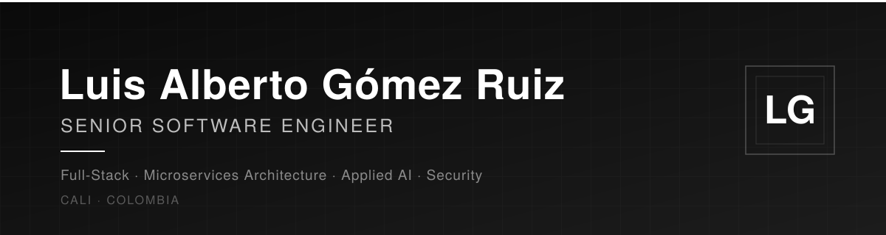

<!-- ====== LANGUAGE SWITCH ====== -->

  
  

<!-- ====== HERO BANNER ====== -->

  

  &nbsp;
  &nbsp;
  &nbsp;
  

  
  

 

<!-- ====== FREELANCE PITCH ====== -->

  <b>Full-stack software engineer available for freelance projects.</b> 
  I design and build robust backend systems, modern interfaces, and <b>AI integrations</b>: 
  APIs, microservices, regulatory platforms, AI agents, and deep learning models. 
   
  <b>Got a project in mind?</b> I take your idea from architecture to deployment.

  

 

<!-- ====== RESUME ====== -->
<h3 align="center">⎯⎯⎯⎯⎯⎯⎯⎯⎯⎯  RESUME  ⎯⎯⎯⎯⎯⎯⎯⎯⎯⎯</h3>

  For those who want to dive deeper into my professional experience:  
  
  

 

<!-- ====== CURRENT EXPERIENCE ====== -->
<h3 align="center">⎯⎯⎯⎯⎯⎯⎯⎯⎯⎯  CURRENT EXPERIENCE  ⎯⎯⎯⎯⎯⎯⎯⎯⎯⎯</h3>

  <b>Senior Software Development Engineer</b> · Carvajal Tecnología y Servicios 
  2025 — Present

Building <b>Kumbre</b>, an electronic invoice reception platform operating across 
🇨🇴 Colombia · 🇲🇽 Mexico · 🇵🇪 Peru · 🇸🇻 El Salvador · 🇺🇸 United States 
Backend in Java/Spring Boot · Frontend in Angular & React · LLMs and AI agents integration.

 

<!-- ====== STACK ====== -->
<h3 align="center">⎯⎯⎯⎯⎯⎯⎯⎯⎯⎯  TECH STACK  ⎯⎯⎯⎯⎯⎯⎯⎯⎯⎯</h3>

<table align="center">
<tr>
<td align="center" width="33%">

**Backend**

</td>
<td align="center" width="33%">

**Frontend**

</td>
<td align="center" width="33%">

**AI & Data**

</td>
</tr>
<tr>
<td align="center">

**Cloud & DevOps**

</td>
<td align="center">

**Data**

</td>
<td align="center">

**Security & Tooling**

</td>
</tr>
</table>

 

<!-- ====== PROJECTS ====== -->
<h3 align="center">⎯⎯⎯⎯⎯⎯⎯⎯⎯⎯  FEATURED PROJECTS  ⎯⎯⎯⎯⎯⎯⎯⎯⎯⎯</h3>

<table align="center" width="100%">
<tr>
<td width="50%" valign="top">

#### 🤖 TutorIA
**RAG** chatbot over internal manuals for technical support, built on Java/Spring Boot with semantic retrieval and LLMs.

`Java` `Spring Boot` `RAG` `LLMs`

</td>
<td width="50%" valign="top">

#### ⚽ Football Analytics (Thesis)
Comparison of **MLP / LSTM / hybrid** architectures with advanced metrics (xG, PPDA, adjusted possession) across European leagues 2018–2025.

`Python` `TensorFlow` `Keras`

</td>
</tr>
<tr>
<td width="50%" valign="top">

#### 🔍 Fraud Detection
**Anomaly detection with autoencoders**, reaching a 0.98 ROC AUC over financial transactions.

`Python` `Keras` `scikit-learn`

</td>
<td width="50%" valign="top">

#### 🧪 Local AI Lab
Development environment with **Ollama + Qwen** and **Spec-Driven** workflows to switch between local LLMs and APIs to optimize costs.

`Ollama` `OpenCode` `Continue.dev`

</td>
</tr>
</table>

 

<!-- ====== CERTIFICATES ====== -->
<h3 align="center">⎯⎯⎯⎯⎯⎯⎯⎯⎯⎯  CERTIFICATES  ⎯⎯⎯⎯⎯⎯⎯⎯⎯⎯</h3>

Continuous learning grouped by platform and category · <a href="./certificados">view all files</a>

<table align="center" width="100%">
<tr>
<td valign="top" width="50%">

<h4 align="center">🟣 Udemy</h4>

**Backend**
- Node: From Zero to Expert · 28.5 h
- Spring Framework

**Cloud / Serverless**
- Introduction to Serverless, Lambdas & API Gateway with AWS · 3.5 h

</td>
<td valign="top" width="50%">

<h4 align="center">🟠 AWS</h4>

**Cloud**
- Serverless

<h4 align="center">🔵 IBM</h4>

**Artificial Intelligence**
- AI Developer (Coursera)

</td>
</tr>
<tr>
<td valign="top" width="50%">

<h4 align="center">🔴 Google</h4>

**Cloud / Fundamentals**
- (add certificate)

<h4 align="center">🟢 Cisco</h4>

**Networking / Security**
- (add certificate)

</td>
<td valign="top" width="50%">

<h4 align="center">🟡 Coursera</h4>

**Artificial Intelligence / Development**
- IBM AI Developer

<h4 align="center">🟦 Platzi</h4>

**Development / Fundamentals**
- (add certificates)

</td>
</tr>
</table>

 

<!-- ====== CTA ====== -->
<h3 align="center">⎯⎯⎯⎯⎯⎯⎯⎯⎯⎯  LET'S WORK TOGETHER  ⎯⎯⎯⎯⎯⎯⎯⎯⎯⎯</h3>

  Backend development · APIs · Frontend · AI integrations · Cloud architecture  
  
  

Languages: Spanish (native) · English (B1) · Portuguese (A1)

