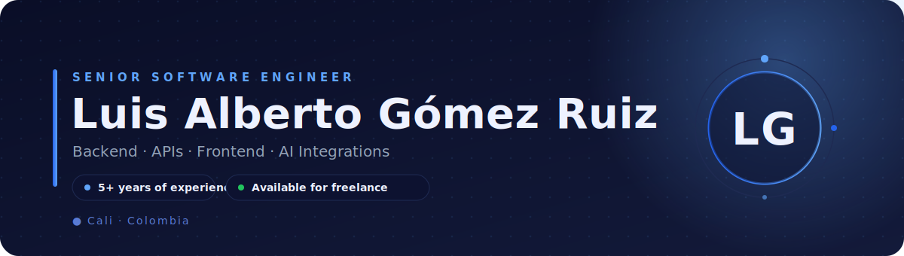
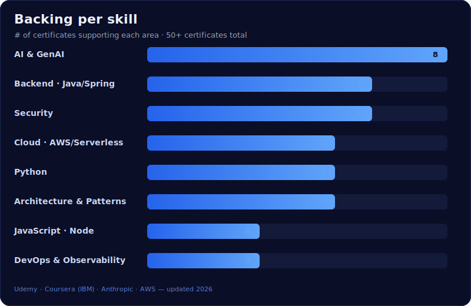

<!-- ====== LANGUAGE SWITCH ====== -->

  
  

<!-- ====== HERO BANNER ====== -->

  

  &nbsp;
  &nbsp;
  &nbsp;
  

 

<!-- ====== FREELANCE PITCH ====== -->

  <b>Full-stack software engineer available for freelance projects.</b> 
  I design and build robust backend systems, modern interfaces, and <b>AI integrations</b>: 
  APIs, microservices, regulatory platforms, AI agents, and deep learning models. 
   
  <b>Got a project in mind?</b> I take your idea from architecture to deployment.

  

 

<!-- ====== RESUME ====== -->

  For those who want to dive deeper into my professional experience:  
  
  

 

<!-- ====== STACK ====== -->

<table align="center">
<tr>
<td align="center" width="33%">

**Backend**

</td>
<td align="center" width="33%">

**Frontend**

</td>
<td align="center" width="33%">

**AI & Data**

</td>
</tr>
<tr>
<td align="center">

**Cloud & DevOps**

</td>
<td align="center">

**Data**

</td>
<td align="center">

**Security & Tooling**

</td>
</tr>
</table>

 

<!-- ====== PROJECTS ====== -->

Public repositories at <a href="https://github.com/luisgr97?tab=repositories">github.com/luisgr97</a>

<table align="center" width="100%">
<tr>
<td width="50%" valign="top">

#### 🍔 [FoodSaas](https://github.com/luisgr97/FoodSaas)
A **food delivery / marketplace** app connecting customers with restaurants to manage online orders.

`JavaScript`

</td>
<td width="50%" valign="top">

#### 🔎 [Semantic Search Optimization](https://github.com/luisgr97/Semantic-optimization-system-of-documentary-and-referential-search-equations-in-a-state-of-the-art)
A system that applies **AI and text mining** to optimize the search equations used in state-of-the-art research.

`Python` `NLP` `Text Mining`

</td>
</tr>
<tr>
<td width="50%" valign="top">

#### 🌐 [community-social-media](https://github.com/luisgr97/community-social-media)
**REST API** for a social network: profiles, posts and user interactions.

`Go`

</td>
<td width="50%" valign="top">

#### 🛡️ [Meta PII Data Analyzer (DLP)](https://github.com/luisgr97/Meta_PII_Data_Analizer_DLP)
A data analyzer for **personally identifiable information (PII) detection** and **data loss prevention (DLP)**.

`Python` `Security` `DLP`

</td>
</tr>
<tr>
<td width="50%" valign="top">

#### ⚡ [energycorp](https://github.com/luisgr97/energycorp)
A simulated **energy organization** system: Django + DRF backend, React + reactstrap frontend, continuous deployment with Travis CI.

`Django` `DRF` `React`

</td>
<td width="50%" valign="top">

#### 🤖 [ml-model-maker-microservice](https://github.com/luisgr97/ml-model-maker-microservice)
A **microservice** that builds and trains **machine learning** models exposed through an API.

`Python` `Machine Learning` `Microservice`

</td>
</tr>
</table>

 

<!-- ====== CERTIFICATES ====== -->

50+ certificates backing each skill · <a href="./certificados">view all files</a>

  

👇 Each skill links to its certificates (click = GitHub PDF viewer)

<b>🧠 AI &amp; GenAI</b> · 8 certificates

- [IBM Specialization · IBM AI Developer](./certificados/Coursera/Inteligencia%20Artificial/Especializaci%C3%B3n%20de%20IBM%20IBM%20AI%20Developer.pdf)
- [Introduction to Artificial Intelligence (AI)](./certificados/Coursera/Inteligencia%20Artificial/Introduction%20to%20Artificial%20Intelligence%20%28AI%29.pdf)
- [Generative AI · Introduction and Applications](./certificados/Coursera/Inteligencia%20Artificial/Generative%20AI%20Introduction%20and%20Applications.pdf)
- [Generative AI · Prompt Engineering Basics](./certificados/Coursera/Inteligencia%20Artificial/Generative%20AI%20Prompt%20Engineering%20Basics.pdf)
- [Generative AI · Elevate your Software Development Career](./certificados/Coursera/Inteligencia%20Artificial/Generative%20AI%20-%20Elevate%20your%20Software%20Development%20Career.pdf)
- [Building Generative AI-Powered Applications with Python](./certificados/Coursera/Inteligencia%20Artificial/Building%20Generative%20AI-Powered%20Applications%20with%20Python.pdf)
- [Complete MCP Course (Model Context Protocol)](./certificados/Udemy/Inteligencia%20Artificial/Curso%20Completo%20MCP.pdf)
- [NLP · Natural Language Processing with Python](./certificados/Udemy/Inteligencia%20Artificial/NLP.%20Procesamiento%20del%20lenguaje%20natural%20con%20NLP%20y%20Python.pdf)

<b>☕ Backend · Java/Spring</b> · 6 certificates

- [Spring Framework 5 + REST from Zero to Expert](./certificados/Udemy/Backend/Java%20-%20Frameworks/Spring%20Framework%205%20%2B%20REST%20de%20cero%20a%20experto.pdf)
- [Intro to Spring Web MVC 5.0 with Spring Boot](./certificados/Udemy/Backend/Java%20-%20Frameworks/Introducci%C3%B3n%20a%20Spring%20Web%20MVC%205.0%20con%20Spring%20Boot.pdf)
- [Microservices with Spring Cloud](./certificados/Udemy/Backend/Java%20-%20Frameworks/Microservicios%20con%20Spring%20cloud.pdf)
- [Learn Apache Camel Framework with Spring Boot](./certificados/Udemy/Backend/Java%20-%20Frameworks/Learn%20Apache%20Camel%20Framework%20with%20Spring%20Boot.pdf)
- [Java Messaging Service · Spring MVC, Spring Boot, ActiveMQ](./certificados/Udemy/Backend/Java%20-%20Frameworks/Java%20Messaging%20Service%20-%20Spring%20MVC%2C%20Spring%20Boot%2C%20ActiveMQ.pdf)
- [Gradle for Java Developers](./certificados/Udemy/Backend/Java%20-%20Frameworks/Gradle%20for%20java%20developers.pdf)

<b>🔐 Security</b> · 6 certificates

- [OWASP Top 10 API · API Security (2026)](./certificados/Udemy/Seguridad/OWASP%20Top%2010%20API%20-%20Seguridad%20en%20APIs%20%28Actualizado%202026%29.pdf)
- [OWASP · Web Security](./certificados/Udemy/Seguridad/OWASP%2C%20seguridad%20web.pdf)
- [Complete Cryptography Course from Zero to Expert](./certificados/Udemy/Seguridad/Curso%20Completo%20de%20Criptograf%C3%ADa%20de%20cero%20a%20experto.pdf)
- [Palo Alto Networks · Cybersecurity Foundation](./certificados/Coursera/Seguridad/Palo%20Alto%20Networks%20Academy%20Cybersecurity%20Foundation.pdf)
- [Enterprise System Management and Security](./certificados/Coursera/Seguridad/Enterprise%20System%20Management%20and%20Security.pdf)
- [Windows Server Management and Security](./certificados/Coursera/Seguridad/Windows%20Server%20Management%20and%20Security.pdf)

<b>☁️ Cloud · AWS/Serverless</b> · 5 certificates

- [Intro to Serverless, Lambdas & API Gateway with AWS](./certificados/Udemy/Backend/JavaScript%20-%20Framework/Introducci%E2%94%9C%E2%94%82n_a_Serverless__Lambdas_y_Api_Gateway_con_AWS.pdf)
- [AWS Lambda · A Practical Guide](./certificados/Udemy/Infraestructura/Nube/AWS%20Lambda%20-%20A%20Practical%20Guide%20-%20Learn%20from%20an%20Expert.pdf)
- [Serverless with AWS and Serverless Framework](./certificados/Udemy/Infraestructura/Nube/Serverless%20en%20Espa%C3%B1ol%20con%20AWS%20y%20Serverless%20Framework.pdf)
- [Serverless Website Hosting on Amazon AWS](./certificados/Udemy/Infraestructura/Nube/Alojamiento%20de%20Sitio%20Web%20en%20Modo%20Serverless%20en%20Amazon%20AWS.pdf)
- [AWS · Basic Course for Web Developers](./certificados/Udemy/Infraestructura/Nube/AWS%20Curso%20B%C3%A1sico%20para%20desarrolladores%20web.pdf)

<b>🐍 Python</b> · 5 certificates

- [Python for Data Science, AI &amp; Development](./certificados/Coursera/Inteligencia%20Artificial/Python%20for%20Data%20Science%2C%20AI%20%26%20Development.pdf)
- [Developing AI Applications with Python and Flask](./certificados/Coursera/Inteligencia%20Artificial/Developing%20AI%20Applications%20with%20Python%20and%20Flask.pdf)
- [Building Generative AI-Powered Applications with Python](./certificados/Coursera/Inteligencia%20Artificial/Building%20Generative%20AI-Powered%20Applications%20with%20Python.pdf)
- [The Build a SAAS App with Flask](./certificados/Udemy/Backend/Python%20-%20Frameworks/The%20Build%20a%20SAAS%20App%20with%20Flask.pdf)
- [NLP · Natural Language Processing with Python](./certificados/Udemy/Inteligencia%20Artificial/NLP.%20Procesamiento%20del%20lenguaje%20natural%20con%20NLP%20y%20Python.pdf)

<b>🏛️ Architecture &amp; Patterns</b> · 5 certificates

- [SOLID Principles and Clean Code](./certificados/Udemy/Paradigmas%20y%20principios%20arquitecturales/Principios/Principios%20SOLID%20y%20Clean%20Code.pdf)
- [Software Design Patterns and SOLID Principles](./certificados/Udemy/Paradigmas%20y%20principios%20arquitecturales/Patrones/Patrones%20de%20dise%C3%B1o%20de%20software%20y%20principios%20SOLID.pdf)
- [Java Design Patterns](./certificados/Udemy/Paradigmas%20y%20principios%20arquitecturales/Patrones/Patrones%20de%20Dise%C3%B1o%20Java.pdf)
- [Object-Oriented Programming](./certificados/Udemy/Paradigmas%20y%20principios%20arquitecturales/Paradigmas/Programaci%C3%B3n%20Orientada%20a%20Objetos.pdf)
- [Functional Programming in Java with Lambdas and Streams](./certificados/Udemy/Paradigmas%20y%20principios%20arquitecturales/Paradigmas/Programaci%C3%B3n%20funcional%20en%20Java%20con%20Lambdas%20y%20Streams.pdf)

<b>🟨 JavaScript · Node</b> · 3 certificates

- [Node · From Zero to Expert](./certificados/Udemy/Backend/JavaScript%20-%20Framework/Node_-_De_cero_a_experto.pdf)
- [JavaScript Master · JS, jQuery, Angular, NodeJS](./certificados/Udemy/Backend/JavaScript%20-%20Framework/Master%20en%20JavaScript%20-%20Aprender%20JS%2C%20jQuery%2C%20Angular%2C%20NodeJS.pdf)
- [TypeScript · Your Complete Guide and Handbook](./certificados/Udemy/Backend/JavaScript%20-%20Framework/TypeScript%20-%20Tu%20completa%20gu%C3%ADa%20y%20manual%20de%20mano.pdf)

<b>⚙️ DevOps &amp; Observability</b> · 3 certificates

- [DevOps, APIs and Microservices Architecture Fundamentals](./certificados/Udemy/Infraestructura/Devops/Fundamentos%20en%20DevOps%2C%20APIs%20y%20Arquitectura%20de%20Microservicios.pdf)
- [Continuous Software Quality Management with SonarQube](./certificados/Udemy/Infraestructura/Devops/Gesti%C3%B3n%20Continua%20de%20la%20Calidad%20del%20Software%20con%20SonarQube.pdf)
- [Grafana · Beginners to Advance Crash Course](./certificados/Udemy/Infraestructura/Devops/Grafana%20Beginners%20to%20Advance%20Crash%20Course.pdf)

<b>🤖 Anthropic · Claude</b> · 4 certificates

- [Claude 101](./certificados/Claude/Claude%20101.pdf)
- [Claude Code 101](./certificados/Claude/Claude%20Code%20101.pdf)
- [Claude Platform 101](./certificados/Claude/Claude%20Platform%20101.pdf)
- [AI Fluency for Small Businesses](./certificados/Claude/AI%20Fluency%20for%20Small%20Businesses.pdf)

<b>📚 Data, Infra, Networking &amp; Fundamentals</b>

- [Learn Docker from Zero to Expert with Compose and Swarm](./certificados/Udemy/Infraestructura/Contenedores%20y%20Virtualizaci%C3%B3n/Aprende%20Docker%20de%20cero%20a%20experto%20con%20Compose%20y%20Swarm.pdf)
- [Cisco · IP Addressing and Subnetting (CCNA)](./certificados/Udemy/Infraestructura/Redes/Cisco%20Curso%20de%20direccionamiento%20IP%20y%20Subnetting%20-%20CCNA.pdf)
- [Linux Server Setup from Scratch](./certificados/Udemy/Infraestructura/Nube/Montajes%20de%20Servidores%20en%20Linux%20desde%20Cero.pdf)
- [SQL Server Query Optimization](./certificados/Udemy/Backend/SQL/Optimizaci%C3%B3n%20de%20Consultas%20con%20Sql%20Server.pdf)
- [Complete University-Level Statistics Course](./certificados/Udemy/Paradigmas%20y%20principios%20arquitecturales/Matematicas/Curso%20completo%20de%20Estad%C3%ADstica%20a%20nivel%20universitario.pdf)
- [Introduction to Software Engineering](./certificados/Coursera/Inteligencia%20Artificial/Introduction%20to%20Software%20Engineering.pdf)
- [Introduction to HTML, CSS, &amp; JavaScript](./certificados/Coursera/Inteligencia%20Artificial/Introduction%20to%20HTML%2C%20CSS%2C%20%26%20JavaScript.pdf)
- [Software Developer Career Guide and Interview Preparation](./certificados/Coursera/Inteligencia%20Artificial/Software%20Developer%20Career%20Guide%20and%20Interview%20Preparation.pdf)

 

<!-- ====== CTA ====== -->

  Backend development · APIs · Frontend · AI integrations · Cloud architecture  
  
  

Languages: Spanish (native) · English (B1) · Portuguese (A1)

